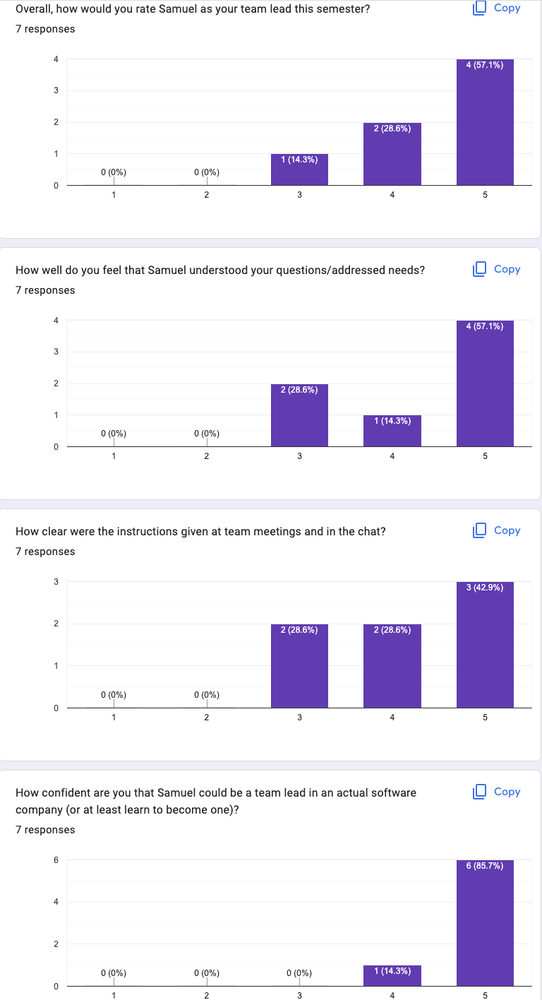
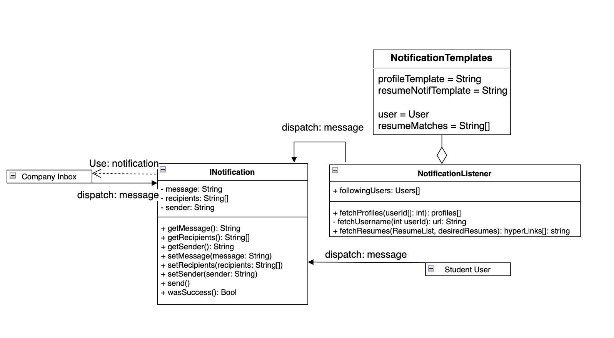
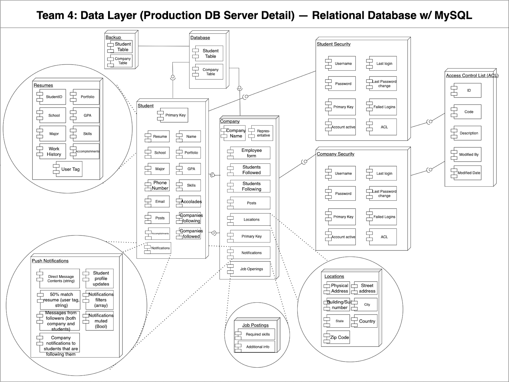
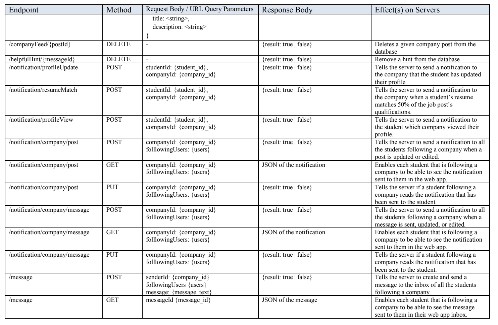
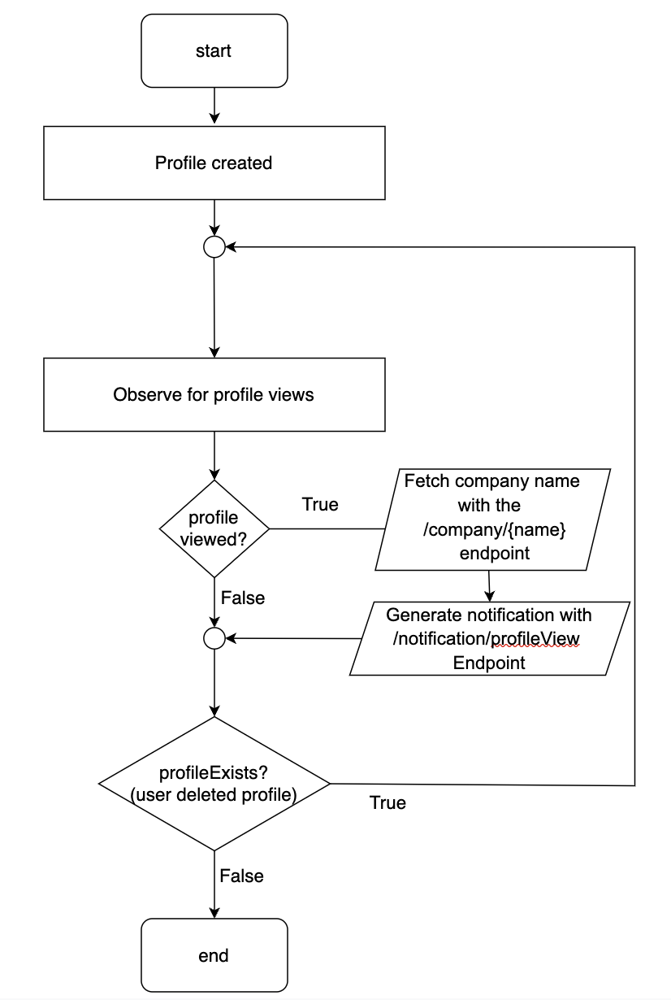

# Career-Application-UML

Contained within this repository is a collection of various UML diagrams that
I have created as part of my database team's deliverable for our SDD to fulfull
the requirements of a comprehensive web application similar to LinkedIn.

These diagrams showcase my expertise in creating UML diagrams commonly used in the tech industry.
These include:
- Class Diagrams
- Component Diagrams
- API Endpoint Table
- Flowcharts
- Pseudocode

# Authorship

Authors are included in the pdf embedded in this repository.
I was one of the four (4) team leaders involved in designing a comprehensive web application.

# Personal Impact

As a team leader, I had to many roles to fulfill, which included planning and conducting weekly team meetings, 
attending weekly team leader meetings with the project manager, and coaching each of my
team members in performing well in their respective roles. 
Having performed to the best of my abilities, I received positive feedback from various teammates,
as shown in this performance evaluation conducted at the conclusion of the project.

Under the direction of my project manager, I was also faithful in designing various UML diagrams to illustrate the 
inner-workings of our web application. My work includes designing the following:

| Diagram (Click to maximize image size) | Diagram Name | Diagram Type | Purpose |
| ----------- | ----------- | ----------- | ----------- |
|  | Companies Notifications | UML Class diagram | Highlight the different entities relating to company-specific notifications and reference them to the behaviors their respective front-end components call upon. |
|  | Team 4 Data Layer | Component Diagram | Describe the overall database architecture. |
|  | Backend Rest API Endpoints | API Endpoint Table | Lists all the available URIs for the frontend/end users to access. |
|  | Profile View Noticiation | Flowchart | Describe the basic logic for user profile view notification trigger. |
| -Pseudocode.png) | CompanyMessagesInterface.studentUpdateMessage() | Pseudocode | Describe the algorithm of studentUpdateMessage() |

# Personal Insights

The backend consists of different entites, each attached with its own service layer.
The different entities that can correspond to our application can include job postings, users, companies, etc. 
Each entity, or component, consists of the following:

- Service
- Controller 
- Repository

The controller is mainly responsible for application flow control logic. Bound to the handler's path,
the controller can call specific methods in specific classes with said path.

The repository for the corresponding entity will then find the information requested for the specific inquiry.
The inquiry is held in a Data Transfer Object (DTO).

For example, in the case of profile service, the repository will find for the student by id.

# Further Reading

[More info on controllers in service layers](https://learn.microsoft.com/en-us/aspnet/mvc/overview/older-versions-1/models-data/validating-with-a-service-layer-cs)
[Component vs Repository vs Service vs Controller](https://www.geeksforgeeks.org/difference-between-component-repository-service-and-controller-annotations-in-spring/)
